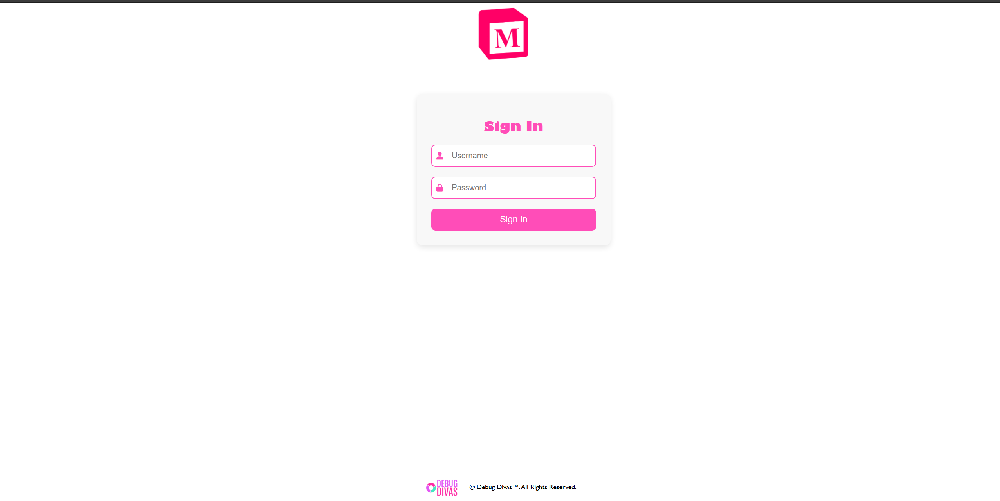
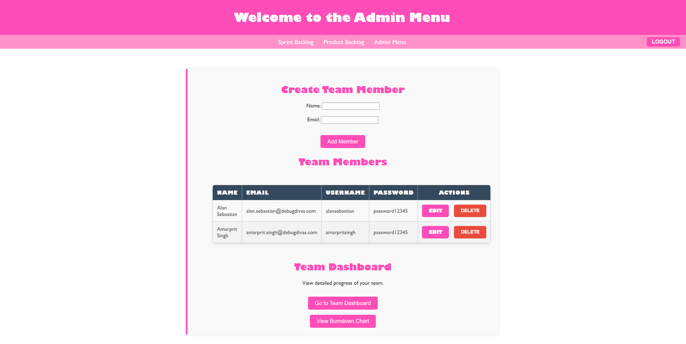
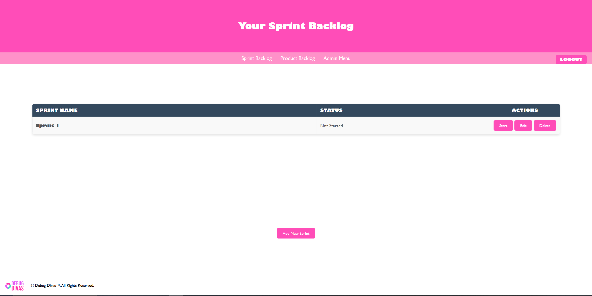
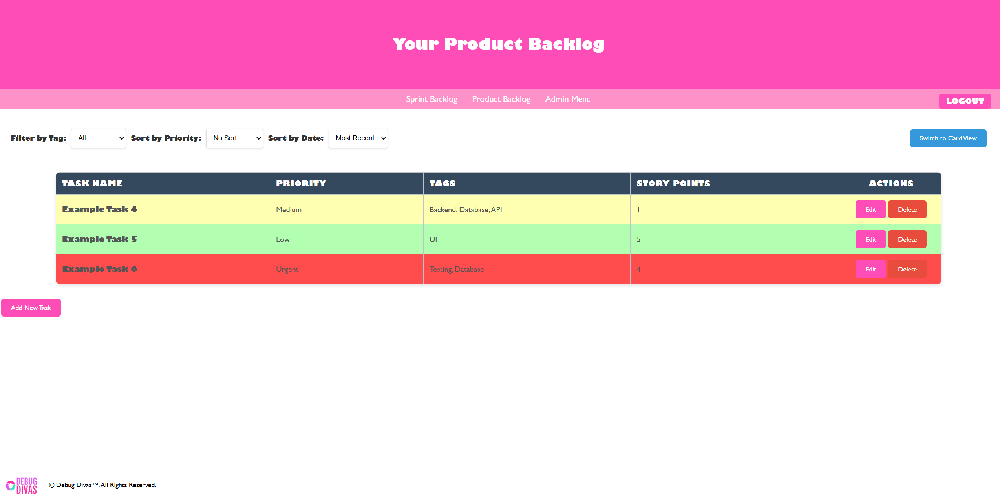

# Scrum Team Management App

A web-based Scrum management tool designed to help teams manage product backlogs, sprint planning, and task tracking through an interactive Kanban board.

---

## Live Demo
(Add your deployed link here — e.g. Netlify/Vercel)

---

## Screenshots

### Login Page

### Admin Dashboard

### Sprint Backlog

### Kanban Board

---

## Features

### User Authentication System
- Login system with admin and user roles
- Session handling using localStorage
- Protected routes (redirect if not logged in)

### Admin Dashboard
- Create, edit, and delete team members
- Automatically generate usernames and assign default passwords
- Dynamic UI updates using DOM manipulation

### Product Backlog Management
- Create and manage Product Backlog Items (PBIs)
- Store and update tasks using localStorage

### Sprint Backlog System
- Create, edit, and delete sprints
- Assign PBIs to specific sprints
- Track sprint status (Not Started, In Progress, Completed)

### Kanban Board
- Visual task tracking system per sprint
- Move tasks across columns (To Do, In Progress, Done)
- Sprint-specific task loading using URL parameters and localStorage fallback

### Dynamic Navigation
- Role-based navigation (admin vs user)
- Page protection and redirect logic

---

## Tech Stack

- HTML  
- CSS  
- JavaScript (Vanilla)  
- LocalStorage (client-side state management)

---

## My Contributions

- Designed and implemented the Admin Page  
  - CRUD functionality for managing team members  
  - Dynamic DOM updates  

- Built the Login System  
  - Authentication logic for admin and users  
  - Session handling using localStorage  
  - Page redirection and access control  

- Developed the Sprint Backlog System  
  - Sprint creation, editing, and deletion  
  - Task assignment logic between backlog and sprint  
  - Sprint lifecycle tracking  

- Implemented Kanban Board Integration  
  - Dynamic loading of sprint-specific tasks  
  - State persistence using localStorage  
  - Task movement across workflow stages  

- Improved Navigation & Access Control  
  - Role-based UI rendering  
  - Protected routes across multiple pages  

---

## System Design

- Frontend-only application (no backend)
- State managed using browser localStorage
- Data stored as JSON objects (users, tasks, sprints)
- Navigation handled via URL parameters with localStorage fallback

---

## Project Structure

- `Login Page/` → authentication system  
- `Admin Page/` → team member management  
- `Product Backlog Page/` → task creation and management  
- `Sprint Backlog Page/` → sprint planning and assignment  
- `Kanban Board/` → task tracking per sprint  
- `Photos/` → UI assets and screenshots  

---

## How to Run Locally

1. Clone the repository  
2. Open the folder in VS Code  
3. Use Live Server OR open `index.html`  
4. Start from the login page and navigate through the app  

---

## Default Login Credentials

### Admin
- Username: `admin`  
- Password: `admin12345`

### User
- Username: `alansebastian`  
- Password: `password12345`

---

## Notes

- This project uses localStorage only (no backend)
- Data will reset if browser storage is cleared
- Kanban board requires a sprint to be selected first

---

## Key Learnings

- Managing state across multiple pages without a backend  
- Handling navigation dependencies using URL parameters  
- Preventing crashes when required data is missing  
- Structuring a multi-page JavaScript application  
- Implementing role-based access control  

---

## Future Improvements

- Backend integration (database + authentication)
- Persistent user accounts
- Real-time updates (WebSockets)
- Improved UI/UX design
- Migration to a framework (React)
